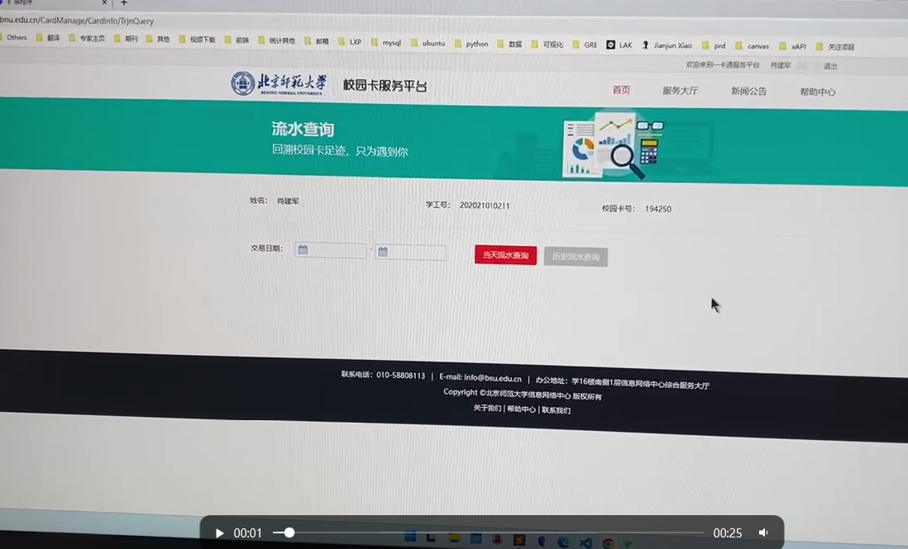

# bnu-consumption-pattern

这是一个专门为师大同学开发的浏览器插件，其主要价值是了拓展校园卡消费数据查询与统计功能。通过它，同学以数据的视角认识自己。当前还是一个简单的Demo，后续会增加复杂的统计算法和美观的可视化。😊

### Demo 

#### 原系统


#### 视频


### Create this project

```
vue create bnu-consumption-pattern  
```

```
vue add chrome-extension-cli  
```


```
npm install element-plus
```

See [vue-cli-plugin-chrome-extension-cli](https://www.npmjs.com/package/vue-cli-plugin-chrome-extension-cli)  

### Compiles and hot-reloads for development
```
npm run build-watch
```

### Compiles and minifies for production
```
npm run build
```